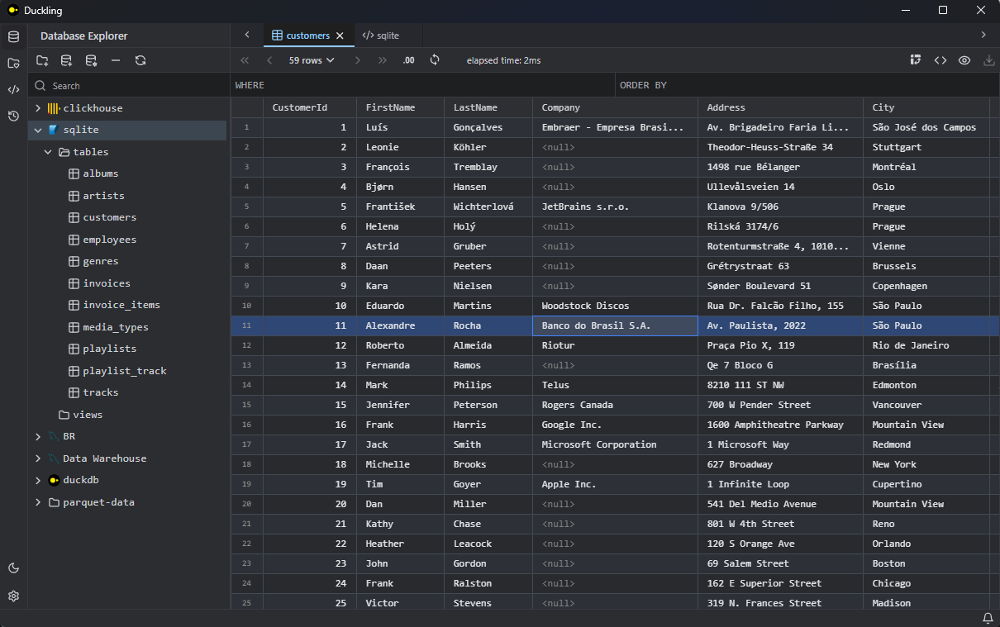
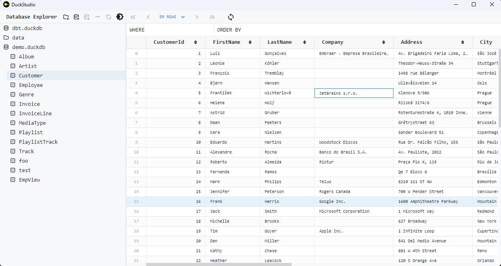

⚠️ Actively in Development and currently unstable ⚠️

# Duckling

English | [中文](./README.zh.md)

Duckling is a lightweight desktop application built using [Tauri](https://v2.tauri.app/), designed for quickly browsing `parquet`/`csv`/`json` file data and various databases. Beyond browsing, it ships with a SQL editor, pivot tables, column profiling, value inspection, and data export to help you explore and analyze data without leaving the app.

It supports [DuckDB](https://github.com/duckdb/duckdb) / SQLite natively, and provides experimental support for the following databases (not heavily tested):

- PostgreSQL
- MySQL
- ClickHouse (HTTP interface, usually port `8123`)
- Doris / StarRocks (MySQL protocol, usually port `9030`)

Note: The current objective of this project is not to develop a fully functional database management tool, but rather to facilitate quick browsing and lightweight analysis of various types of data.

## Features

- **Data browsing** — Canvas-rendered result grid with pagination, column hiding, transpose, result filtering, and per-cell value inspection.
- **SQL editor** — Monaco-based editor with schema-aware autocomplete, run / format / `EXPLAIN` actions, and SQL bookmarks.
- **SQL template variables** — Write Jinja2-style `{{ variable }}` placeholders in SQL, declare values via a `/* @vars */` YAML block comment, and run multi-value queries (cartesian product → multiple result tabs) in one click. See [SQL Templates](#sql-templates) below.
- **Pivot table** — Build pivots from row/column dimensions and measures (`count` / `sum` / `avg` / `min` / `max`), with high-cardinality warnings and copy-SQL support.
- **Column profile** — Per-column statistics: total, null ratio, distinct count, min/max, and top values.
- **Count by column** — Value distribution for a column, shown as a table plus a bar chart.
- **Value viewer** — Inspect a cell in raw / JSON form, with a "Calculate" tab for per-selection statistics (min/max/mean/…) exported as Markdown.
- **Export** — Export the current result to CSV / TSV / JSON / Parquet / XLSX with delimiter, header, and compression options.
- **Sidebar** — Database explorer, query history, and favorites (pinned tables + saved SQL), all searchable.
- **Settings suite** — Appearance & language, SSH profiles, keyboard shortcuts, SQL formatting, import/export options, and in-app updates.
- **Keyboard shortcuts** — A categorized shortcut overlay (`Mod+/`) and a reconfigurable hotkey settings page.

## Supported data sources

Implemented connectors:

- **DuckDB** — open a `*.duckdb` file (plus an optional working path).
- **DuckDB (Quack)** — connect via URI + token (in-memory / remote Quack).
- **Data folder** — pick a directory to browse `parquet` / `csv` / etc.
- **SQLite** — open a database file.
- **MySQL** — host / port / database / user / password.
- **PostgreSQL** — host / port / database / user / password + SSL mode.
- **ClickHouse** — host / port / database / user / password (HTTP interface).

Experimental (not heavily tested):

- **Doris / StarRocks** — via the MySQL protocol, usually port `9030`.

Additional entry points:

- **File association** — opening a `.duckdb` or `.parquet` file launches Duckling directly.
- **SSH tunnel** — available for MySQL / PostgreSQL, using reusable SSH profiles or manual configuration.
- **Connection transfer** — export / import one or all connections as JSON, with optional master-password-encrypted secrets.

## Installation

From the [releases](https://github.com/l1xnan/Duckling/releases) page, download the latest installer for your platform.

For Windows, if you cannot install WebView2 due to network issues, you can [install WebView2 offline](https://developer.microsoft.com/en-us/microsoft-edge/webview2/#download-section).

**Note**: When selecting an installation path, choose an empty folder or create a new one. Do not put data files in the installation path, and avoid selecting a non-empty folder. During uninstallation, if you choose to clear data files, the entire folder is deleted — even files that do not belong to the software.

## Usage

Open a data folder, a `*.duckdb` file, or a database connection.





## SQL Templates

Write a template once and run it against different tables or values without copying.

### Quick start

```sql
/*
@vars
schema: public
table:
  - orders
  - order_items
  - payments
*/

SELECT COUNT(*) FROM {{ schema }}.{{ table }}
```

1. **Run normally** (`Mod+Enter` / toolbar ▶). The backend reads `@vars`, finds `{{ schema }}` and `{{ table }}`, expands each combination, and opens a result tab for each row.
2. **Missing variables** — If a placeholder has no value yet, a dialog pops up to fill in one value per line. Check "Save values as @vars comment above SQL" to write the filled values back as a `@vars` block — next run needs no dialog.
3. **Toolbar `{}` button** — Select SQL, click `{}` in the toolbar to auto-generate an `@vars` scaffold for all `{{ name }}` placeholders found in the selection. Fill in values directly in the editor.

### Examples

**Single variable — batch across tables**

```sql
/*
@vars
table:
  - customers
  - orders
  - products
*/

SELECT COUNT(*) AS cnt FROM {{ table }}
```

→ 3 result tabs: count of `customers`, `orders`, `products`.

**Multiple variables — cartesian product**

```sql
/*
@vars
schema: public
region:
  - us
  - eu
*/

SELECT region, COUNT(*) AS cnt
FROM {{ schema }}.{{ table_prefix }}_{{ region }}
GROUP BY region
```

With `table_prefix` set to `sales` in the dialog, this expands to 2 SQLs (`public.sales_us`, `public.sales_eu`), each producing one result tab.

**Date range in WHERE**

```sql
/*
@vars
table: events
start_date: '2024-01-01'
end_date: '2024-12-31'
*/

SELECT date, COUNT(*)
FROM {{ table }}
WHERE dt BETWEEN {{ start_date }} AND {{ end_date }}
GROUP BY date
```

**Column names in aggregation**

```sql
/*
@vars
measure: revenue
segment: country
*/

SELECT {{ segment }}, SUM({{ measure }}) AS total
FROM sales
GROUP BY {{ segment }}
ORDER BY total DESC
```

### Syntax

| Construct | Meaning |
|-----------|---------|
| `{{ name }}` | Variable placeholder (Jinja2 interpolation syntax). Name must be a simple identifier. |
| `/* @vars` … `*/` | Leading block comment declaring YAML variable values. Supports scalars (single value) and sequences (multi-value). |
| Single value | `table: orders` |
| Multi value | `table:` then `  - orders` / `  - items` (one per line, YAML list) |
| Empty scaffold | `table: ''` — generated by `{}` button when no value exists yet |

### How it works

- **Backend** (Rust + minijinja): Parses the `@vars` YAML block, renders the Jinja template with `UndefinedBehavior::Strict` and `AutoEscape::None`, and performs a cartesian product when several variables have multiple values (max 50 combinations).
- **Frontend** (TypeScript): Pure helpers (`src/lib/sql/macros.ts`) for formatting YAML blocks, merging dialog overrides, and building empty scaffolds.
- **No effect** on existing SQL without `{{ }}` placeholders.

### Batch execution

When a variable has multiple values (YAML list or multi-line in dialog), the system generates one statement per combination and opens a result tab for each. All tabs execute in parallel. A soft limit (20) asks for confirmation; a hard limit (50) rejects.

### Toolbar button

The `{}` button (next to EXPLAIN) scans the current selection (or the full buffer if no selection) for `{{ name }}` placeholders, then inserts or updates a `/* @vars */` block with empty values for missing variables. Edit the values directly and run — no dialog.

### Keyboard shortcuts

- `Mod+B` — toggle sidebar
- `Mod+/` — keyboard shortcuts help
- `Mod+Enter` — run SQL
- `Mod+Shift+Enter` — run SQL in a new tab
- `Shift+Alt+F` — format document
- `Mod+K` then `Mod+F` — format selection
- `Mod+W` — close tab
- `F2` — rename connection
- `F3` — connection properties
- `F4` — open SQL editor
- `F5` — refresh
- `Delete` — delete connection

(`Mod` = `Ctrl` on Windows/Linux, `Cmd` on macOS.)

## Development

### Prerequisites

- Node.js and [pnpm](https://pnpm.io/) (the repo uses `pnpm-lock.yaml`; `npm` / `yarn` will fail).
- Rust toolchain for Tauri (`cargo`).

### Commands

```bash
pnpm install            # install dependencies (pnpm only)
pnpm dev                # start the Vite dev server (http://localhost:5173)
pnpm tauri dev          # run the Tauri app in development
pnpm build              # build the frontend (Vite -> dist)
pnpm tauri build        # build the installable app
pnpm test               # run the Vitest test suite
pnpm lint               # type-check (tsc)
pnpm i18n:extract       # extract i18n messages (Lingui)
pnpm i18n:compile       # compile i18n catalogs (Lingui)
```

Optional: to use the `shandy-sqlfmt` SQL formatting engine, install it with `uv tool install shandy-sqlfmt`.

### Tech stack

Tauri 2 (Rust workspace) · React 19 + TypeScript + Vite · Monaco editor · VisActor VTable (Apache Arrow transport) · Zustand + Jotai · Tailwind CSS v4 · Lingui i18n (English / Simplified Chinese) · cross-platform (Windows / macOS / Linux).

## Q&A

On Windows, DuckDB requires the [Microsoft Visual C++ Redistributable](https://learn.microsoft.com/en-us/cpp/windows/latest-supported-vc-redist?view=msvc-170) at **runtime**. If DuckDB-related features misbehave, this dependency is the likely cause — download and repair it. See [Building DuckDB on Windows](https://duckdb.org/docs/stable/dev/building/windows).
