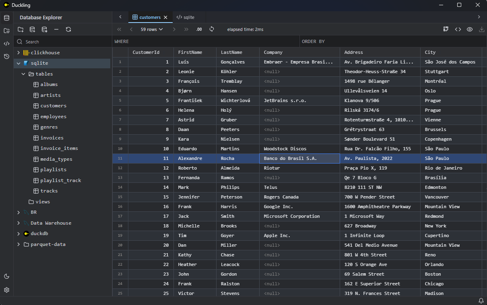
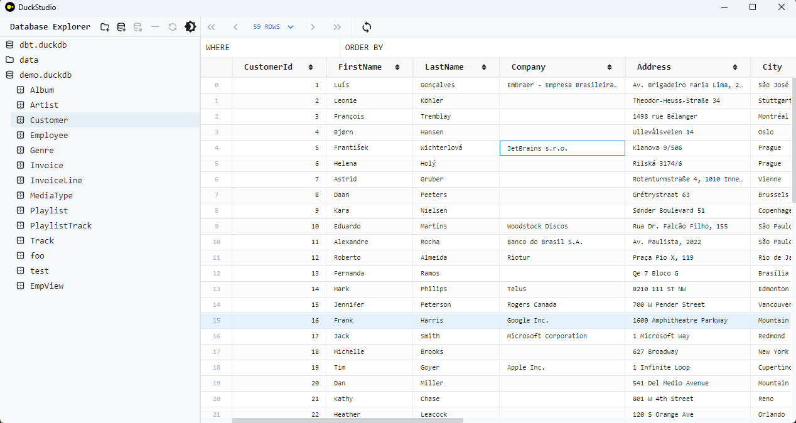

# Duckling

[English](./README.md) | 中文

Duckling 是使用 Tauri 构建的轻量级桌面应用，用于快速浏览 `parquet`/`csv` 文件数据和 [DuckDB](https://github.com/duckdb/duckdb) 数据库数据，对于 Clickhouse 提供实验性的支持（注意仅支持 [Native Protocol port](https://clickhouse.com/docs/en/guides/sre/network-ports)，一般是 `9000`）。

## 安装

从 [releases](https://github.com/l1xnan/Duckling/releases) 页面下载最新的安装包，进行安装。

对于 Windows 平台，依赖 Webview2，如果遇到网络问题无法安装，可以[离线下载](https://developer.microsoft.com/en-us/microsoft-edge/webview2/#download-section)安装 Webview2。

## 使用

打开数据文件夹或者 `*.duckdb` 文件。

## 开发

如果 `bundled` 构建失败，可以下载在 duckdb releases 页面下载对应平台和版本的 libduckdb 文件，例如：[libduckdb-windows-amd64.zip](https://github.com/duckdb/duckdb/releases/download/v0.9.1/libduckdb-windows-amd64.zip) 到 `./src-tauri` 文件夹。
